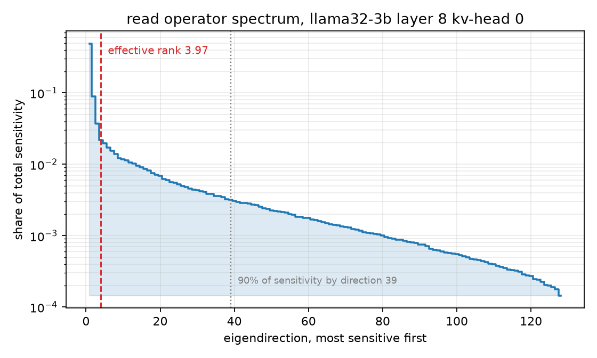
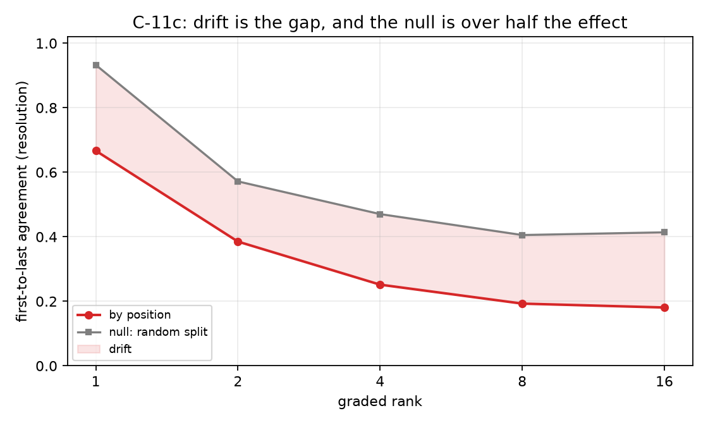
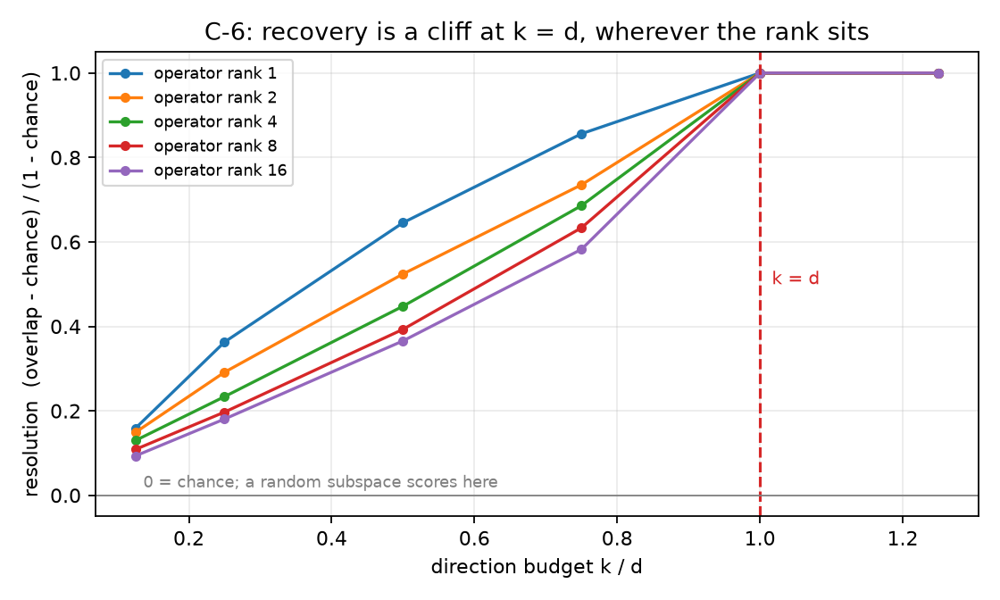

# readscope

**Measure which directions of a vector a computation actually reads — from
the outside, with nothing but function calls.**

[](https://pypi.org/project/readscope/)
[](PRINCIPLES.md)
[](SPEC.md)
[](CALIBRATION.md)
[](tests/)
[](LICENSE)

## The problem it solves

Say you are quantizing a KV cache. You compress a key vector, you measure
reconstruction error, it looks tiny, you ship it. But the attention head that
later *reads* that key does not care about most of the vector — it is
sensitive to a low-dimensional slice of it, and reconstruction error treats
every direction as equally important. Two codecs can tie exactly on
reconstruction and still behave very differently downstream, because one of
them happens to damage the directions the head actually uses.

This is not hypothetical. On Llama-3.2-3B attention heads, two key codecs
tied on reconstruction to 7.5e-9 **by construction** still differed
downstream by a median relative-KL gap of 1.85. Choosing between them by
sensitivity-weighted distortion picked the better arm on **16 of 16** heads.
Choosing by reconstruction error picked it on 2 of 16 — a coin flip.

readscope measures that sensitivity directly, so you can spend your bits on
the directions that matter and stop grading compression on a metric the
downstream computation is blind to.

## What it does, in plain terms

Throughout this README, a **consumer** is any function that reads your
vector: an attention head reading a cached key, the next layer reading an
activation, a scoring function reading an embedding. If you can call it, you
can probe it.

The recipe is finite differencing, done carefully:

1. Nudge the input `x` in a direction, watch how much the output moves.
2. Do this over enough directions and operating points to accumulate the
   sensitivity matrix `S = E[g gᵀ]`, where `g = ∇ₓ C(x)`.
3. Eigendecompose `S`. The top eigenvectors are the directions the consumer
   reads; the eigenvalues say how hard it reads each one.

The eigenvalue spectrum plays the role a power spectrum plays for a signal:
it shows where the consumer's sensitivity lives. And `water_fill` allocates
a bit budget against it the same way power is allocated across frequency
bins — that is not an analogy but literally the same optimization, with
downstream sensitivity in place of signal power.

The probe is **blind**: it never sees a label, a Jacobian, or a hint about
which directions matter. It sees `consumer(x)` and nothing else.

## Quickstart

```python
from readscope import blind_probe, spectrum_of, water_fill

# consumer: any callable from a d-dimensional vector to a scalar margin.
# operating_points: an array of representative inputs (e.g. real activations).
probe = blind_probe(consumer, operating_points)

spec = spectrum_of(probe.S)
spec.effective_rank      # how many directions this consumer really reads
spec.energy_rank(0.9)    # how many carry 90% of its sensitivity

# Spend a bit budget where the sensitivity is:
alloc = water_fill(spec.eigenvalues, budget=4.0 * spec.dim)
alloc.n_starved          # directions that earn no bits at this budget
```

If your consumer returns a **vector** rather than a scalar, use
`jacobian_probe` instead — each probe direction then yields `m` numbers
instead of one, so it resolves roughly its output width in directions at
half the budget.

## Backends, and big `d`

The measuring core is numpy and stays numpy: every default path is
byte-for-byte what it always was. Two additions change what happens at
scale, without changing what a reading means:

- **GPU when the data is GPU.** Hand the probes CuPy arrays and the
  linear algebra (pinv, QR, eigh) runs where the data lives; hand them
  numpy and nothing new is imported. Random directions are always drawn
  with numpy in the same order, so a GPU run and a CPU run of the same
  seed probe the same directions exactly. With torch, the
  [tqp-readscope](https://github.com/ahb-sjsu/turboquant-pro/tree/master/plugins/tqp-readscope)
  bridge moves CUDA activations in zero-copy via DLPack.
- **`top_spectrum(S, r)` for large operators.** At `d` in the
  thousands, a full `eigh` dominates the cost of reading a spectrum.
  `top_spectrum` computes the leading `r` directions by block subspace
  iteration — pure numpy, GPU-generic — and reports whole-spectrum
  aggregates *exactly* (effective rank needs only the trace and the
  Frobenius norm, no eigenvalues). Its `energy_rank` answers only as
  far as the computed directions reach and **raises rather than
  extrapolates** past its coverage.

What none of this changes: **the budget law.** The cliff at `k = d` is
a property of consumer calls, not FLOPs — it is a theorem
([PRINCIPLES.md](PRINCIPLES.md), P3) — and a faster backend buys speed,
never admission.

## The one rule: budget `2d` calls per operating point

For an input of dimension `d`, give the probe `2d` consumer calls per
operating point — or expect the dominant direction and nothing else.
Recovery against the direction budget `k/d` is a cliff, not a slope:

| `k/d` | 0.25 | 0.5 | 0.75 | **1.0** | 1.25 | 1.5 |
|---|---:|---:|---:|---:|---:|---:|
| directions resolved | 1 | 2 | 2 | **16** | 16 | 16 |

Three quarters of the budget buys two directions of sixteen; the last
quarter buys the other fourteen. And the cliff does **not** soften if you
only want the top direction: below full dimension the estimate is a
projection onto a random subspace, and a projected operator's leading
eigenvector is not the operator's. Cheap and half-right is not on the menu;
it is cheap and wrong or full-price and exact.

Practically: the default `mode="exact"` spends `2d` calls and is correct.
`mode="lstsq"` with `sketch_dim >= dim` is equivalent. The cheaper
`"sketch"` and `"ortho"` modes exist and are honestly characterized in
[SPEC.md](SPEC.md) — they resolve one or two directions, and are only worth
reaching for if that is genuinely all you need.

## When it refuses to measure

Some consumers cannot be probed by finite differences, and readscope raises
rather than returning a confident wrong answer:

- **Selection consumers** (top-k routers, argmax gates): their output
  depends on the *order* of scores, so their derivative is zero almost
  everywhere. A naive probe would report "reads nothing" about a component
  that decides everything. `readscope.regimes` carries the right
  instruments for that case — the routing margin and the differential
  fraction — inherited from
  [turboquant-pro](https://github.com/ahb-sjsu/turboquant-pro).
- **Recurrences** are admitted but flagged: a pointwise Jacobian is well
  defined and misleading, because compounding along the sequence scales
  error as `1/(1-a)²`.

## The displays

`pip install 'readscope[viz]'`, then `from readscope import viz`. matplotlib
is optional; the measuring core stays numpy-only.

Six displays, one per thing the calibration program measured, each drawn
with the caveat that belongs to it — the annotation is what stops the
picture from lying.



A real attention head, recovered blind. Two summaries deliberately disagree
here: the participation ratio says ~4 directions dominate, while 39 are
needed to carry 90% of the sensitivity. Both are true — a few directions
dominate *and* a long tail holds real mass — and a display showing only one
number would misrepresent the operator.



The drift display refuses to plot a curve without its null (the same
comparison run on two samples of the *same* distribution). Comparing
against 1.0 instead of the null is exactly the mistake calibration C-11b
made, and it overstated the effect by more than a factor of two.



The budget cliff, drawn. Every operator rank lands on the same cliff at
`k = d`.

Regenerate everything from the committed records with
`python calibration/make_figures.py`. It invents nothing: a figure whose
data is missing is skipped and reported, never filled in with something
illustrative.

## How much to trust it

An instrument is trusted because it is specified, not because it worked
once — an oscilloscope ships with bandwidth, sample rate, and noise floor.
This one ships with the same sheet; [SPEC.md](SPEC.md) has every number and
every still-empty cell.

| Field | Status |
|---|---|
| Sample rate | Exact. `2d` calls per point, or `2k` sketched |
| Noise floor | Exact. Chance overlap `rank/dim`, reported with every reading |
| Minimum usable budget | **Measured. A cliff at `k = d`, rank-independent** |
| Accuracy | **124 real model cells at resolution 1.000 at `k/d = 1.25`** |
| Applicability | Bounded, and enforced in code |
| Temperature drift | Four model families spread 1e-15; four scales spread 7e-16 |
| Input impedance | Axis measured and dimensionless. **Correction: no** |
| Linearity | Partial. Direction transfers across domains, magnitude does not |

The accuracy line is graded against **exact closed-form ground truth**, not
against another estimate: the read subspace of an attention head with
respect to a key is spanned by its queries, and that of a recurrent state by
its decay-attenuated readout vectors. 124 cells across Llama-3.2-3B,
Qwen2.5 (1.5B→32B), Mistral-7B, Gemma-3-4B, and a Mamba-790m all recover
at resolution 1.000 at `k/d = 1.25`.

Three caveats worth knowing before trusting a reading:

- **Probe loading is the known error term.** The probing distribution is
  not the activation distribution, so the recovered operator is averaged
  over a slightly wrong measure. There is deliberately *no* scalar
  correction for this, and after three attempts there is a reason rather
  than a gap: degradation depends on whether the probing shift is *aligned*
  with the read subspace — in high dimension a random shift is not — so no
  function of loading alone can correct it.
- **Recovery numbers need their reference named.** A published overlap of
  0.647 for this kind of probe turns out to measure the difference between
  two *references* (softmax-weighted vs unweighted query covariance, ~0.3
  apart in overlap), not probe error: under the source program's own
  settings this probe recovers its reference at resolution 1.000000.
- **Read operators drift along the sequence.** A key compressed against an
  early position's operator is read later by a different one. Measured
  against a paired null, the dominant read direction genuinely moves, and
  allocating bits against the early operator costs the late consumer 225%
  (of a uniform split's cost) more than allocating against the late one.
  This is a candidate mechanism for long-generation degradation under KV
  compression — measured on short sequences, not yet run against a real
  degradation curve.

### The failures are kept

**Thirteen of twenty-one calibrations failed**, and the failures improved
the specification more than the successes did. [CALIBRATION.md](CALIBRATION.md)
keeps every one, wrong claims left standing for the corrections to point at.
The short version of what they taught: two sweeps passed every bar for
spurious reasons (a saturated correction, a quantity pinned by
construction), which produced the house rule — *before believing "X
predicts Y", require a prior bar showing Y varies* — and one sweep nearly
reported real attention heads as degenerate because the query set had been
drawn from the key stream. A pre-declared anti-vacuity bar caught it; the
artifact announced itself instead of becoming a result.

## Install

```bash
pip install readscope
```

Pure numpy. Torch is optional and only needed by the model-facing
extraction scripts under `calibration/`, which ship in the repository rather
than the wheel. For development: `pip install -e ".[dev]"`.

**Using it with turboquant-pro?** `pip install tqp-readscope` registers
these probes as read-operator providers, so the sensitivity-weighted
distortion `tr(P_C Σ_δ)` becomes a number you can gate a codec on.

## Layout

```
readscope/       the instrument
  probe.py       blind recovery of S = E[g gᵀ]; exact, lstsq, sketch, ortho
  spectrum.py    the response spectrum, effective rank, energy rank;
                 top_spectrum for leading-r at large d
  _xp.py         backend dispatch (numpy default; CuPy when handed CuPy)
  allocate.py    reverse water-filling against the spectrum
  metrics.py     subspace overlap and resolution, always with a chance floor
  loading.py     probe loading on a dimensionless axis
  regimes.py     which consumers the probe may be attached to
  quotient.py    tangential/radial displacement split
calibration/     the sweeps, their declared bars, and their records
tests/           exact controls with closed-form answers
SPEC.md          the specification, including the empty fields
CALIBRATION.md   what has been measured, what failed, and what would sink it
```

Calibration records are append-only JSON with the declaration, every cell,
every bar, and a verdict computed from the data rather than written in
advance. A superseded sweep keeps its record and names what replaced it.

## Provenance

The general principles this instrument instantiates — and the untested
predictions they owe — are stated in [PRINCIPLES.md](PRINCIPLES.md).
The theory and first measurements come from the observation-theory program:
[geometric-observation](https://github.com/ahb-sjsu/geometric-observation)
(the blind probe, the sealed preregistrations, the claims ledger) and
[turboquant-pro](https://github.com/ahb-sjsu/turboquant-pro) (the production
compression path that consumes a read operator). This repository is the
instrument pulled out of that program and specified on its own terms — you
need no interest in the program, and no theory of what a "consumer" is, to
point the probe at a function and read the trace.

## License

MIT.
